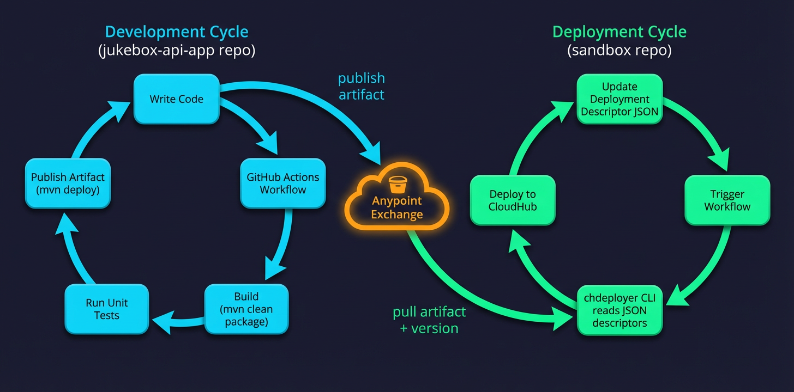

# Sandbox – Deployment Environment Repository

This repository contains the deployment descriptors for the **Sandbox** environment. It is one half of a two-repository workflow that separates **application development** from **environment deployment**.

---

## The Two Cycles

The workflow is split into two interconnected cycles:




### Development Cycle ([jukebox-api-app](https://github.com/chdeployer-demo/jukebox-api-app))

The application source code lives in its own repository. A GitHub Actions workflow handles the full build pipeline:

1. **Code** – Developer writes or updates the Mule application
2. **Build** – `mvn clean package` compiles and packages the application into a `.jar`
3. **Test** – Unit tests are executed during the build phase (when present)
4. **Publish** – `mvn deploy` publishes the versioned artifact to **Anypoint Exchange**

The cycle repeats: code → build → test → publish.

### Deployment Cycle ([sandbox](https://github.com/chdeployer-demo/sandbox))

This repository defines *what* runs in the Sandbox environment. The deployment workflow:

1. **Configure** – Update deployment descriptors in `deployments/` (artifact version, runtime settings, properties)
2. **Trigger** – Manually trigger the GitHub Actions workflow
3. **Deploy** – The [chdeployer](https://github.com/Redpill-Linpro/anypointchdeployer) CLI reads the JSON descriptors, pulls the artifact from Exchange, and deploys to CloudHub

### How They Connect

The two cycles are linked through **Anypoint Exchange**:
- The **development cycle** _publishes_ artifacts to Exchange
- The **deployment cycle** _pulls_ artifacts from Exchange

The version specified in the deployment descriptor (e.g., `1.0.0-SNAPSHOT`) determines which published artifact gets deployed.

---

## Repository Structure

```
sandbox/
├── .github/workflows/
│   ├── deploy-applications.yml       # Deploy Mule apps to CloudHub
│   ├── deploy-api-policies.yml       # Deploy API Manager policies
│   └── deploy-mq-destinations.yml    # Deploy Anypoint MQ destinations
└── deployments/
    └── jukebox-api-app.json          # Deployment descriptor for jukebox-api-app
```

## Deployment Descriptors

Each application has a JSON file in `deployments/` that declares its desired state on CloudHub. Example fields from [`jukebox-api-app.json`](deployments/jukebox-api-app.json):

| Setting | Value |
|---|---|
| Target | CloudHub 2.0 (`MC`) – `eu-central-1` |
| Runtime | Mule 4.9.15, LTS, Java 17 |
| Replicas | 1 |
| vCores | 0.1 |
| Update strategy | Rolling |
| Artifact | `jukebox-api-app:1.0.0-SNAPSHOT` |
| Desired state | `STARTED` |

To deploy a **new version**, update the `version` field in the descriptor and trigger the workflow.

## Workflows

All workflows are triggered manually via `workflow_dispatch`:

| Workflow | Purpose | Config source |
|---|---|---|
| `deploy-applications.yml` | Deploy Mule apps to CloudHub | `deployments/*.json` |
| `deploy-api-policies.yml` | Deploy API Manager policies | `deploy-policies.sh` |
| `deploy-mq-destinations.yml` | Deploy Anypoint MQ destinations | `mq-destinations/*-mq-config.json` |

Workflows run using the [chdeployer](https://github.com/Redpill-Linpro/anypointchdeployer) Docker image (`ghcr.io/redpill-linpro/chdeployer:latest`) and authenticate with Anypoint Connected App credentials stored in the **Sandbox** GitHub Environment.
